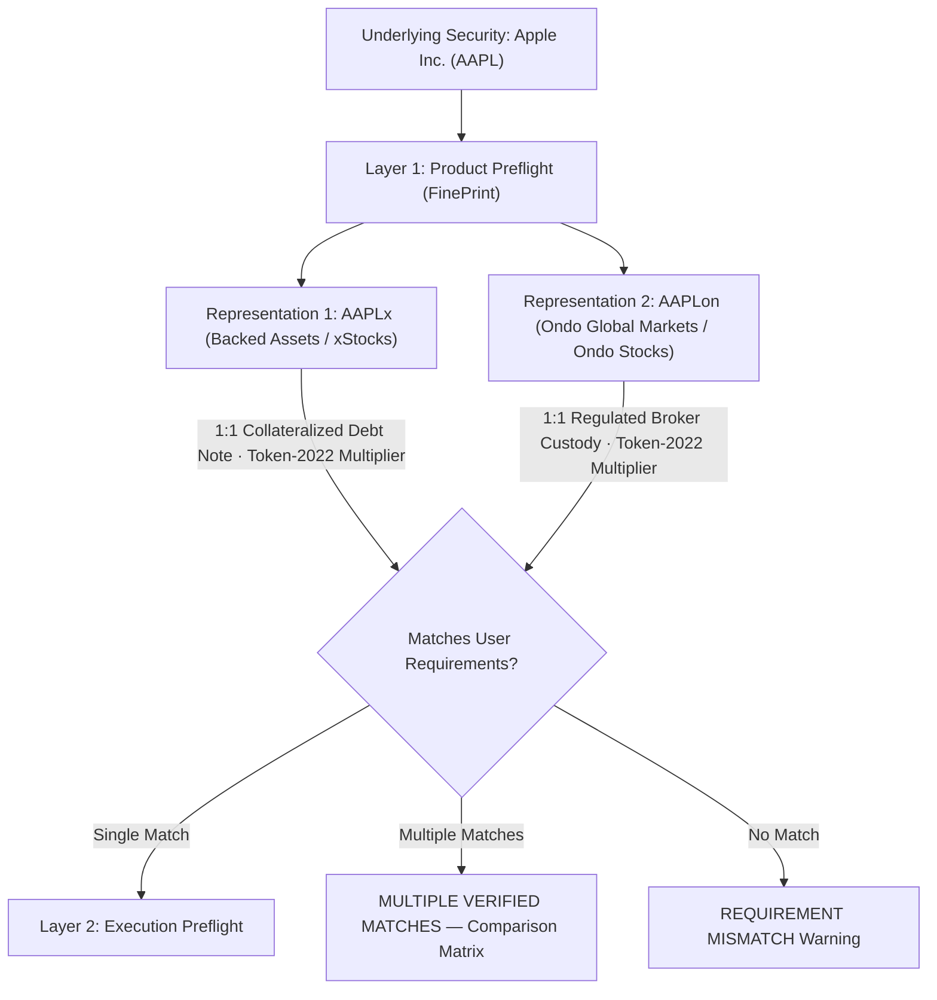

# JustFair — Product Specification

## 1. Product Summary & Two-Layer Safety Model
> **JustFair** helps **everyday retail investors** understand tokenized stock products and verify the true economic fairness of their trades on Solana **before moving a single dollar.**

* **Core Product Promise:** *"KNOW WHAT YOU'RE BUYING. THEN CHECK THE FILL."*
* **Architecture:** JustFair operates two independent, connected safety layers:
  1. **Layer 1: Product Preflight (FinePrint)**
     * *Core Question:* *"Does this exact tokenized-stock product actually give me what I think it gives me?"*
     * *Purpose:* Evaluates user expectation profiles (legal ownership, corporate voting, economic dividends vs wallet payouts, synthetic price exposure, redemption, and trading availability) across all verified representations of an underlying security (e.g. `AAPL` $\to$ `AAPLx`, `AAPLon`) against primary-source legal prospectuses and on-chain Token-2022 facts.
  2. **Layer 2: Execution Preflight (Existing JustFair Engine)**
     * *Core Question:* *"Now that I chose the right product, is this exact trade giving me fair economic execution?"*
     * *Purpose:* Simulates live DEX routes on Solana RPC and compares expected exposure against real-world canonical market benchmarks in plain dollar terms before executing.

---

## 2. Multi-Issuer Architecture: Underlying $\to$ Representations
Investors select what asset they want (e.g. *"I want Apple"*), and FinePrint evaluates all verified on-chain representations without forcing the user to know issuer tickers in advance:

---

## 3. Fact Authority Model & Truth Separation
JustFair enforces strict separation between legal holder rights and on-chain technical states:

| Fact Domain | Authoritative Primary Source | Verified Facts for Solana xStocks & Ondo Stocks | Boundary Constraint |
| :--- | :--- | :--- | :--- |
| **Legal / Holder Rights** | Official Issuer Prospectus, Base Offering Terms, Key Information Documents (KID) | Contractual debt security / structured note tracking equity 1:1; **zero direct shareholder ownership**; **zero corporate voting rights**; net dividends reinvested automatically (Total Return); direct primary redemption restricted to KYC-onboarded eligible participants. | **NEVER** infer legal rights or equity ownership from on-chain token balances or smart contracts. |
| **On-Chain Technical Facts** | Solana Mainnet RPC (`getAccountInfo`), SPL Token-2022 program state | Exact decimals, dynamic multiplier extension (`scaledUiAmountConfig`), freeze authority, permanent delegate, pause status, program factory accounts. | **NEVER** infer legal shareholder standing or SEC registration from Solana token extension flags. |
| **Execution Economics** | Jupiter Swap V2 Order API, Solana RPC Simulation, Nasdaq / Pyth Benchmarks | Net dollar fill, effective shares, slippage, compute units, liquidity depth. | **NEVER** confuse quote price with product suitability or legal entitlement. |

---

## 4. Second-Issuer Reality Check & Kill Gate
* **Evaluation:** `PASS` (Multiple verified active tokenized equity issuers on Solana Mainnet).
* **Supported Issuers:**
  1. **Backed Assets GmbH:** Issues xStocks (e.g. `AAPLx`: `XsbEhLAtcf6HdfpFZ5xEMdqW8nfAvcsP5bdudRLJzJp`, `NVDAx`, `SPYx`, `TSLAx`, `MSFTx`, `AMZNx`, `GOOGLx`, `METAx`, `COINx`, `AMDx`, `MSTRx`, `QQQx`) using SPL Token-2022 dynamic multipliers.
  2. **Ondo Global Markets (BVI) Limited:** Officially expanded Ondo Stocks to Solana in January 2026 under Program ID `XzTT4XB8m7sLD2xi6snefSasaswsKCxx5Tifjondogm` with exact verified mints on Solana Mainnet (e.g. `AAPLon`: `123mYEnRLM2LLYsJW3K6oyYh8uP1fngj732iG638ondo`, `NVDAon`: `gEGtLTPNQ7jcg25zTetkbmF7teoDLcrfTnQfmn2ondo`).
* **Correction Note:** Historical preliminary finding of single issuer status is formally **SUPERSEDED** by primary evidence from Ondo Finance and live Solana Mainnet RPC account dumps.

---

## 5. Product Preflight Expectation Model
Users evaluate products against a deterministic expectation profile:

* **Expectation Priorities:**
  * `REQUIRED`: Hard constraint. A mismatch triggers overall `REQUIREMENT_MISMATCH` for that representation.
  * `OPTIONAL`: Soft preference / nice-to-have. Reported as a non-blocking informational caveat.
  * `NOT_IMPORTANT`: Ignored in verdict determination.

* **Per-Representation Match States:**
  * `MATCH`: Representation verified to fulfill the user expectation.
  * `MISMATCH`: Representation verified NOT to fulfill the user expectation.
  * `CONDITIONAL`: Fulfillable subject to specific conditions (e.g. transferability subject to issuer freeze authority).
  * `UNKNOWN`: Unmodeled or unverifiable expectation.
  * `NOT_APPLICABLE`: Preference marked not important.

* **Overall Underlying Product Verdicts:**
  * `MATCHES_REQUIRED_EXPECTATIONS`: Exactly one verified representation satisfies all required constraints.
  * `MULTIPLE_VERIFIED_MATCHES`: Multiple representations satisfy all required constraints. FinePrint presents the factual trade-offs without arbitrarily declaring a winner.
  * `REQUIREMENT_MISMATCH`: No available representation satisfies all required constraints.
  * `NO_VERIFIED_PRODUCT_MATCH`: Security is unrecognized or has no verified primary-source representations.
  * `UNABLE_TO_VERIFY_PRODUCT`: Fact authority data temporarily unreachable.

---

## 6. "What Happens If...?" Canonical Scenarios

1. **What happens when the company pays a dividend?**
   * *Total Return Multiplier Accretion:* For both xStocks (Backed Assets) and Ondo Stocks (Ondo Finance), net dividends (after applicable withholding tax) are automatically reinvested into the underlying collateral pool, which increases the on-chain Token-2022 `scaledUiAmountConfig` multiplier. Your displayed token balance automatically reflects the dividend exposure without any cash/USDC airdrop.
   * *Dividend Scam Alert:* **Unsolicited tokens or messages sent to your wallet claiming to be "dividend payouts" or asking you to sign a claim transaction are malicious phishing scams.**

2. **What happens during a stock split?**
   * *Mechanism:* Both issuers update on-chain multipliers or token supply configurations to mirror the split ratio exactly, preserving unbroken equity exposure.

3. **Can I transfer tokens between wallets vs buy/sell during weekends?**
   * *Wallet Transferability:* 24/7 on-chain wallet-to-wallet transfers are supported on Solana (subject to standard regulatory freeze/pause compliance controls).
   * *Trading Availability:* Market trading is session-dependent. Off-hours and weekend trading are subject to wider spreads and liquidity risk controls when underlying US exchanges are closed.

4. **Can I redeem this token for physical company shares?**
   * *Mechanism:* Direct primary redemption for cash or shares with either issuer is restricted to KYC-verified Qualified / Whitelisted Investors (non-US). Everyday retail traders buy and sell via secondary liquidity pools on Solana DEXs.

5. **What happens if the issuer goes bankrupt?**
   * *xStocks:* Collateral shares are held in segregated Swiss custody pledged to a security trustee for tokenholders.
   * *Ondo Stocks:* Collateral is held with a regulated custodial broker-dealer under a first-priority perfected security interest protecting tokenholders' claims.

---

## 7. Execution Preflight Boundary Lock
* **xStocks (`AAPLx`, `NVDAx`, etc.):** Execution Preflight fully supported via live Jupiter Swap V2 + Solana RPC simulation + Nasdaq / Pyth benchmarks.
* **Ondo Stocks (`AAPLon`, `NVDAon`, etc.):** Product Preflight verified; Execution Preflight currently flagged as `EXECUTION_PREFLIGHT_NOT_YET_SUPPORTED_FOR_THIS_REPRESENTATION` pending dedicated RFQ/JIT routing in Phase 12/17.
